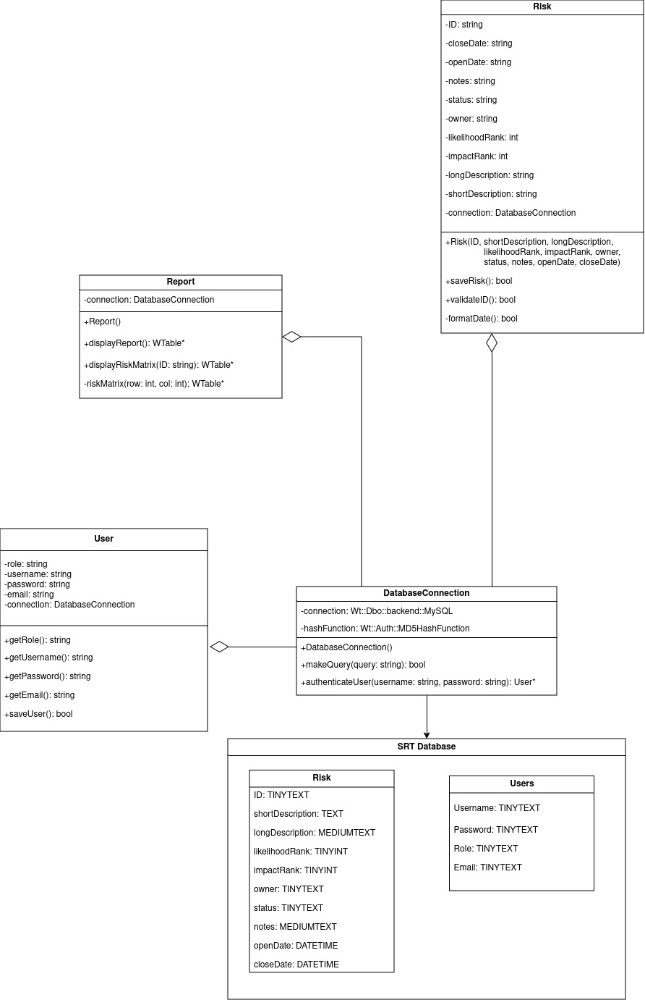
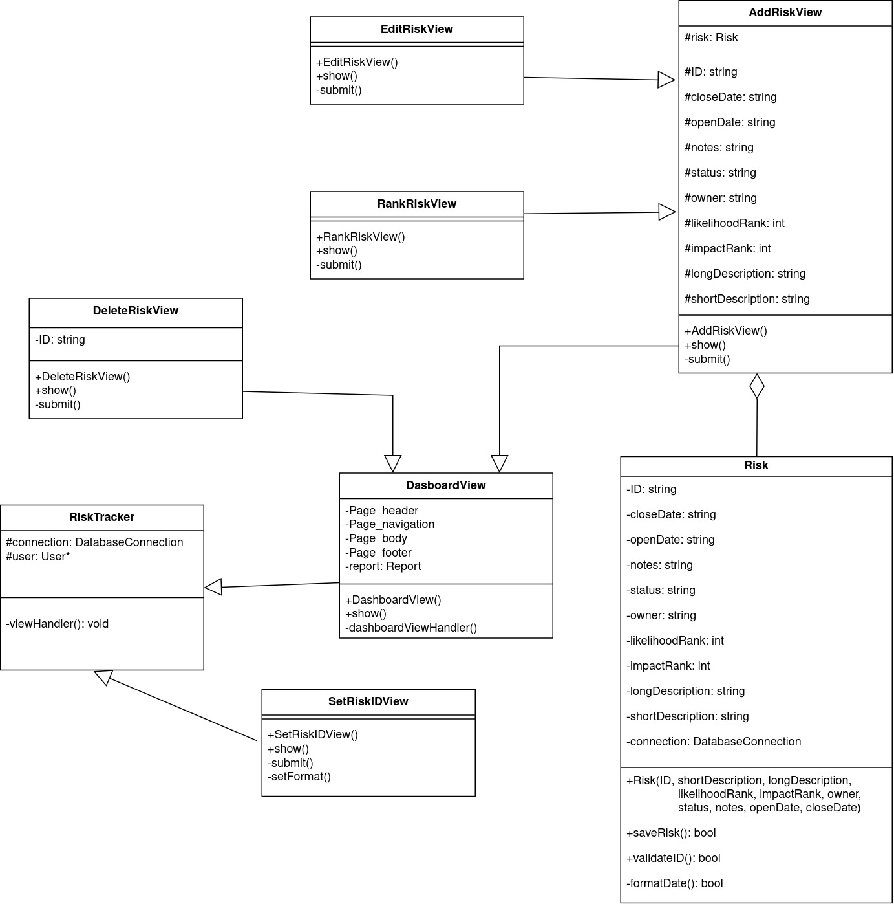
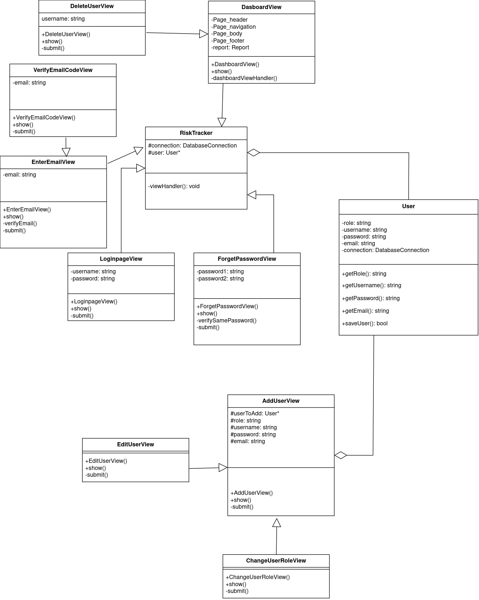

# Software Risk Tracker

A system to keep track of risks, the project is not complete due to time contraints and has deviated far from the original system diagram. The files left are from an MVP (Minimum Viable Product) that was created, but lacked some of the features that were originally intended.

## System Diagram
A full system diagram can be downloaded [here](SDL/Documents/SDD/class-diagram.html).

## Database Connection Architecture

## Risk Architecture

## User Architecture

